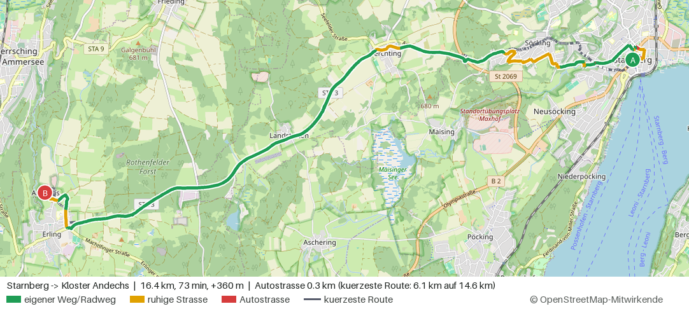
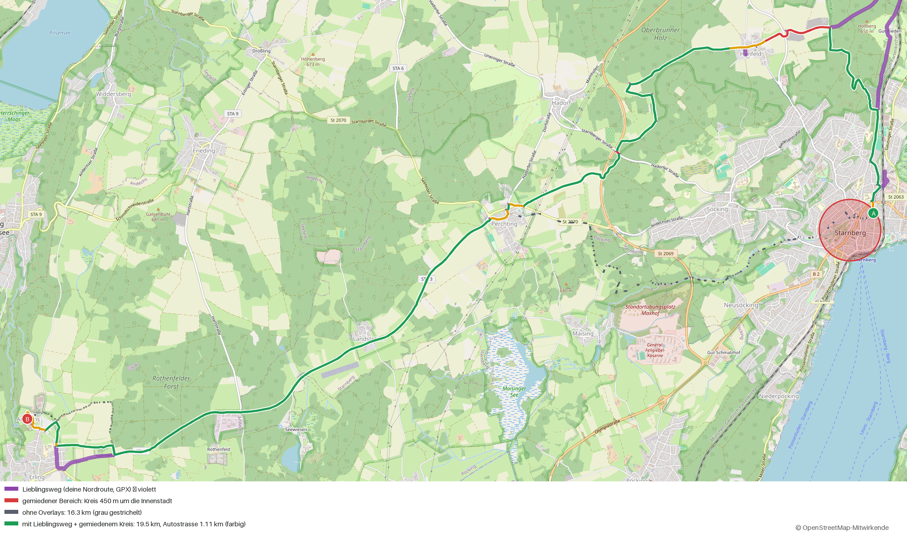
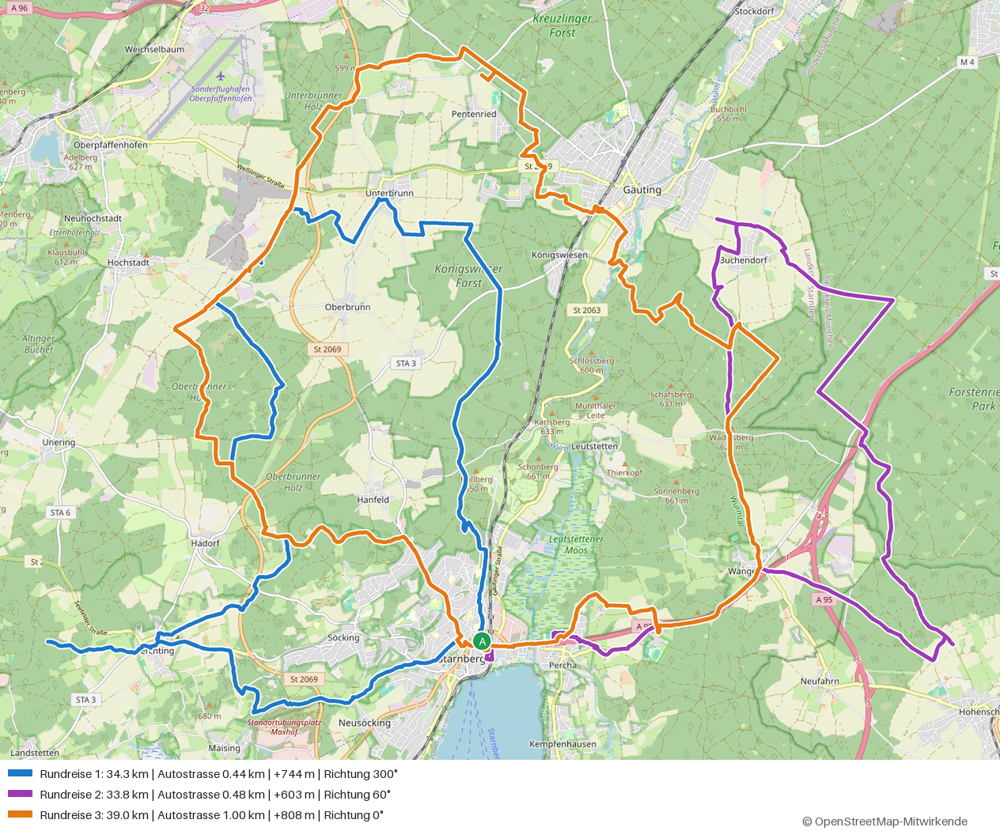
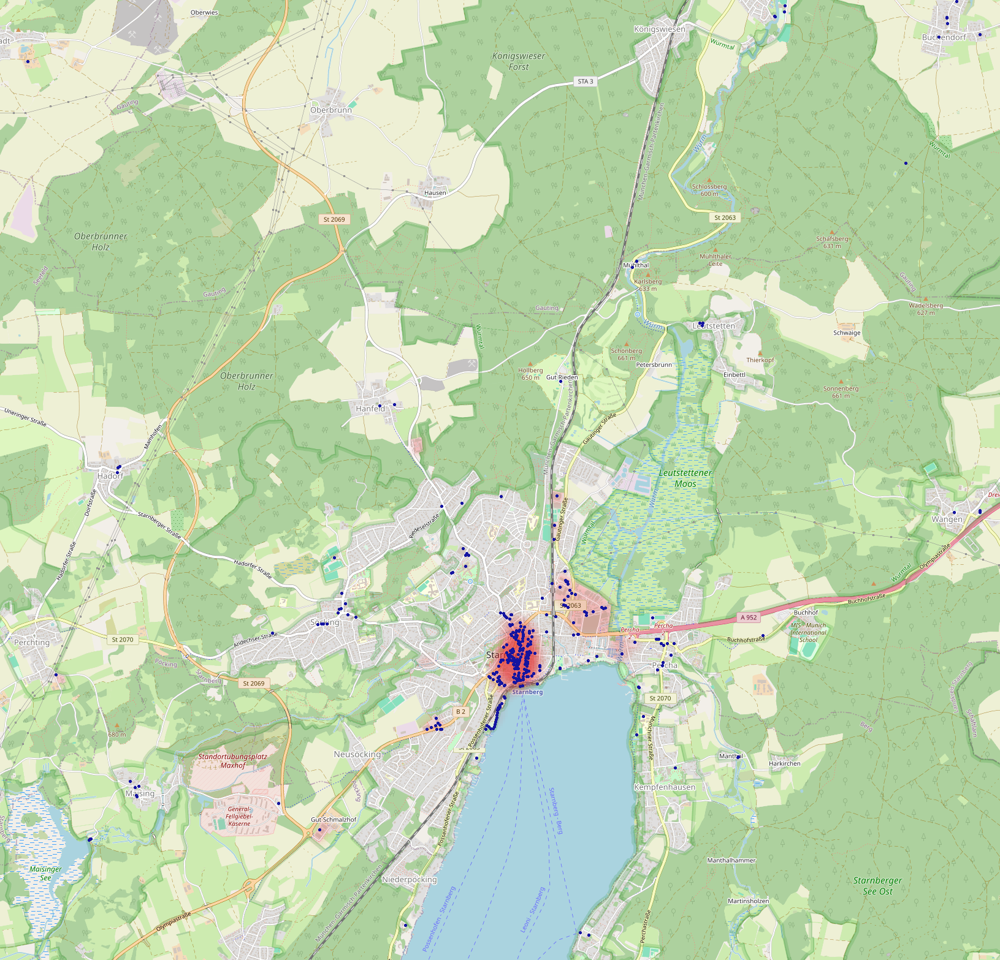
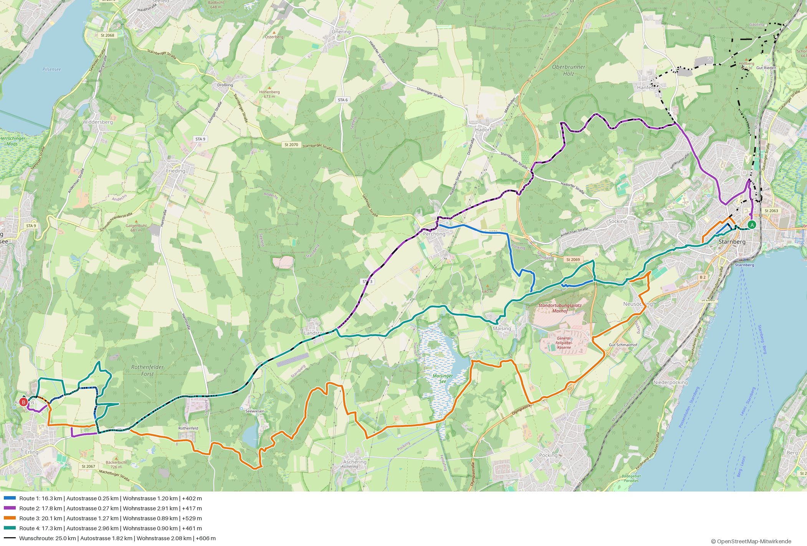

# FahrradNavi

Fahrrad-Routenplaner auf Basis von [OpenStreetMap](https://www.openstreetmap.org), der **Autostraßen konsequent meidet** –
auch wenn dafür ein Umweg von mehreren Kilometern nötig ist. Reines Python, selbst hostbar, mit Weboberfläche
und GPX-Export (z. B. für Komoot, Garmin, Wahoo, OsmAnd).

> **Stand:** Prototyp. Kernlogik, API und Weboberfläche sind getestet (138 Tests mit synthetischem Testnetz, dazu ein Browser-Rauchtest, Browser-Test)
> und mit echten OSM-Daten des Landkreises Starnberg geprüft. Beispiel *Starnberg → Kloster Andechs* (Trekkingrad):
> 16,4 km mit 0,3 km Autostraße – die kürzeste Route (14,6 km) hätte 6,1 km auf Autostraßen. Ganz Bayern ist noch nicht
> gebaut/gemessen, siehe [Skalierung](#skalierung-auf-ganz-bayern).



*Trekkingrad, Standard-Einstellungen: grün = eigener Weg/Radweg, gelb = ruhige Straße, rot = Autostraße.
Erzeugt mit `python scripts/render_route.py "Starnberg" "Kloster Andechs"`.*

## Wie das "Meiden" funktioniert

Normale Navis minimieren Zeit oder Länge und "bestrafen" Straßen nur leicht. FahrradNavi minimiert **Kosten in
Meter-Äquivalenten**: 1 m guter Radweg = 1, aber 1 m Bundesstraße ohne Radweg kostet ×150. Der Router nimmt also lieber
bis zu ~150 m Umweg pro vermiedenem Meter Bundesstraße in Kauf. Ist eine Straße wirklich unvermeidbar (z. B. die einzige
Brücke), wird sie trotzdem befahren – und in der Karte **rot** markiert.

| Weg | Faktor (bei Stärke "konsequent") |
|---|---|
| Radweg (`highway=cycleway`), Feldweg, Pfad | 0,9 – 1,15 |
| Fahrradstraße, Straße **mit baulich getrenntem Radweg** (`cycleway=track`) | ≈ 1 (Straße spielt keine Rolle) |
| Spielstraße / Zufahrt | 1,5 / 2 |
| Wohnstraße | 8 (Tempo 30: ≈ 3,5) – eigener Regler *Wohnstraßen meiden* |
| Nebenstraße (`unclassified`) | 10 |
| Kreisstraße (`tertiary`) | 40 |
| Staatsstraße (`secondary`) | 100 |
| Bundesstraße (`primary`) | 150 |
| `trunk` | 400 |
| Autobahn, Treppen, Fußwege ohne Radfreigabe | gesperrt |

Weitere Faktoren (alle in `src/fahrradnavi/profiles.py` / `costing.py` anpassbar):

* **Radinfrastruktur:** Radfahrstreifen mildert den Malus (Exponent ×0,5), Schutzstreifen/Mitbenutzung (×0,8).
* **Oberfläche & Qualität** je Radtyp: Rennrad meidet Schotter/Kopfsteinpflaster stark, Gravel kaum.
* **Steigungen** (SRTM-Höhen): Kosten je Höhenmeter und für Abschnitte ab 8 % / 12 % Steigung; E-Bike deutlich milder.
* **Ampeln** kosten Zeit, **ausgeschilderte Radrouten** (OSM-Relationen `route=bicycle`) werden leicht bevorzugt.
* `bicycle=use_sidepath` (Radfahrer sollen den Radweg nebenan nutzen) macht die Straße zusätzlich unattraktiv.

Die Weboberfläche zeigt zum Vergleich immer die **kürzeste Route** (grau gestrichelt) und rechnet vor: *"+4,8 km Umweg,
dafür 3,8 km weniger Autostraße"*.

**Regler** (Web und API): *Straßen meiden* 0 (egal) … 1 (konsequent) … 2 (extrem), *Wohnstraßen meiden* 0 … 3 (zusätzlich, nur
Wohn-/Spielstraßen und Zufahrten), *Innenstadt meiden* 0 … 3 und *Bebauung meiden* 0 … 3 (siehe unten), *Steigungen meiden* und *schlechten Belag meiden* je 0 … 3. Profile: `trekking`, `road` (Rennrad), `gravel`, `ebike`.

## Route selbst gestalten: Markierungen, Bereiche, Lieblingswege, Rundreisen

Alles in der Weboberfläche, ohne Neuberechnen von Hand:

* **Route per Markierung ändern:** Mit der Maus über die Route fahren – ein Zieh-Marker erscheint; **Ziehen** fügt ein Zwischenziel
  ein (wie bei Komoot). **Klick auf die Route** öffnet ein Menü: *Zwischenziel hier einfügen* oder *Diese Stelle meiden*
  (Kreis von 60 m). Zwischenziel-Marker sind verschiebbar, mit dem × in der Liste löschbar.
* **Reihenfolge ändern:** Punkte in der Liste am Griff ⠿ ziehen (Maus oder Finger) oder den Griff fokussieren und mit den
  Pfeiltasten ↑/↓ verschieben. Gilt für Start/Zwischenziele/Ziel ebenso wie für die Stationen einer Rundreise; die Route wird
  sofort neu berechnet.
* **Zwischenziele eintippen:** *+ Zwischenziel* fügt vor dem Ziel ein leeres Feld ein (mit Cursor darin); es wird per Ortssuche
  oder per Klick auf die Karte gefüllt. Leere Felder lassen sich mit × wieder entfernen.
* **Zurück zum Start:** Haken *Rundkurs über die Zwischenziele* hängt den Start als Ziel an.
* **Bereiche zum Meiden:** *◯ Kreis meiden* (Mittelpunkt klicken, dann Radius) oder *⬠ Fläche meiden* (Ecken klicken, Doppelklick
  schließt). Wege darin werden bis zu ×50 teurer – **weich**: betreten wird der Bereich nur, wenn es keinen zumutbaren Umweg gibt
  (z. B. weil Start oder Ziel darin liegen). Pro Bereich Stärke-Regler, Ein/Aus, Umbenennen (Doppelklick), Zoom, Löschen.
* **Lieblingswege:** *★ Lieblingsweg (GPX)* lädt eine GPX-Datei; Wege im Abstand ≤ 12 m bekommen einen Bonus (Kosten bis ×0,3).
  Oder eine berechnete Route mit *★ Route merken* übernehmen. Mit Stärke 1 folgt der Router einer vorgegebenen Strecke meist zu
  80–90 %; will man sie exakt, zusätzlich Zwischenziele setzen. Bereiche und Lieblingswege bleiben **im Browser gespeichert**
  (localStorage, pro Gerät) und wirken auf Routen, Alternativen und Rundreisen.
* **Rundreisen:** Reiter *Rundreise* – Start setzen, Länge (5–150 km) und Richtung wählen, *Rundreise berechnen*.
  **Stationen:** Weitere Klicks auf die Karte, die Ortssuche oder *+ Station* legen Orte fest, die die Rundreise in der
  angegebenen Reihenfolge anfährt (Stichwege dorthin bleiben erhalten). Ist die Schleife über die Stationen kürzer als gewünscht,
  wird ein Abschnitt mit einem Umweg verlängert (mehrere Varianten); ist sie schon länger, gibt es sie mit Hinweis auf die
  Mindestlänge. Beim Wechsel zwischen den Reitern bleiben die Punkte erhalten (Zwischenziele/Ziel ↔ Stationen). Der Router legt
  Zwischenpunkte auf einem Kreis um den Start, skaliert ihn auf die Wunschlänge, verteuert bereits benutzte Wege für die Rückfahrt
  (kein Hin-und-zurück), entfernt **Stichwege** (zu einem Zwischenpunkt hin und auf demselben Weg zurück) und lässt Zwischenpunkte
  weg, zu denen die Route als **Spitze** hin und auf einem Parallelweg zurück fahren würde. Zwischenpunkte im See oder außerhalb der
  Karte werden Richtung Start verschoben; ist die Wunschlänge nicht erreichbar, kommt die nächstbeste Schleife mit Hinweis. Angezeigt
  werden bis zu 3 unterschiedliche Schleifen (Länge, Überlappung, Straßenanteil werden bewertet). Alle
  Regler, Bereiche und Lieblingswege gelten auch hier; GPX-Export wie gewohnt.

Während einer Berechnung zeigt die Karte eine deutliche Warteanzeige mit Laufzeit; der Knopf ist solange gesperrt.

API: `avoid_areas` (Kreis `{kind:"circle",lat,lon,radius_m,strength}` / Polygon `{kind:"polygon",points:[…]}`), `favorites`
(`{coords:[{lat,lon}…],strength}`), `loop` und `roundtrip` (`{distance_km,heading}`; weitere Punkte nach dem Start = Stationen) in `POST /api/route` und `/api/gpx`.
Grenzen: 20 Bereiche, 300 Polygonpunkte, Radius ≤ 50 km, 10 Lieblingswege mit zusammen ≤ 20 000 Punkten, Anfrage ≤ 3 MB.



*Violett: Lieblingsweg (GPX), roter Kreis: gemiedener Bereich um die Innenstadt, grau gestrichelt: Route ohne Overlays, farbig: Ergebnis.*



*Drei Rundreisen ab der Leutstettener Straße (Wunsch 35 km): 34,3 / 33,8 / 39,0 km, Richtungen 300° / 60° / 0°.*

Browser-Rauchtest der Bedienung (Playwright): `python scripts/ui_smoke.py` (58 Prüfungen auf Testnetzen).

## Innenstadt meiden

Der Regler *Innenstadt meiden* macht Wege im **Kern einer Innenstadt** teurer – auch Radwege und Fußgängerzonen-Nähe ("Trubel"),
nicht nur Straßen. Als Maß dient die **Dichte von Geschäften, Gastronomie, Kultur, Behörden und Fußgängerzonen** (OSM: `shop`,
`amenity`, `tourism`, `highway=pedestrian`), mit Radius 120 m geglättet, plus schwach Einzelhandels-/Gewerbeflächen. Daraus
entsteht je Kante ein Innenstadt-Wert 0…1; zur Laufzeit gilt Faktor `1 + (3^Regler − 1) × Wert` (Regler 1 → ×3, 2 → ×9, 3 → ×27
im Kern). Kalibriert an Starnberg: Kern (Hauptstraße/Seepromenade) = 1, Bahnhof/See ≈ 0,4, Söcking/Percha = 0
(Schwellwerte `CENTER_DENSITY_LOW/HIGH` in `urban.py`). Die Statistik zeigt die Kilometer im Innenstadt-Kern.



*Blau: erkannte Geschäfte/Gastronomie, rot: Innenstadt-Wert.* Der Wert bildet den **Kern** ab, nicht jeden bebauten Ortsteil –
dafür gibt es *Bebauung meiden*. POI-Daten kommen bei Geofabrik-Extrakten automatisch mit; beim Overpass-Download sind sie in der
Abfrage enthalten. Einen vorhandenen Download nachträglich ergänzen:
`fahrradnavi download starnberg --overpass --pois-only --out data/poi` und `fahrradnavi merge a.osm.pbf b.osm.pbf -o alles.osm.pbf`.
Das Graph-Format hat sich geändert (Version 3) – vorhandene `graph.npz` mit `fahrradnavi build` neu bauen.

## Bebauung meiden

Der Regler *Bebauung meiden* macht Wege innerhalb von **Siedlungsflächen** teurer – auch Radwege und Geh-/Radwege, die für das
Straßen-Modell "sauber" aussehen. Grundlage sind die OSM-Flächen `landuse=residential/commercial/retail/industrial`
(inkl. Multipolygone mit Löchern). Beim Graph-Bau wird für jede Kante der Anteil bestimmt, der in Bebauung liegt; zur Laufzeit
gilt Faktor `1 + (2,5^Regler − 1) × Bebauungsanteil` (Regler 1 → ×2,5, 2 → ×6, 3 → ×16 für Wege komplett in Bebauung).
Die Statistik zeigt zusätzlich die Kilometer in Bebauung. Der Regler wird in der Weboberfläche ausgeblendet, wenn der Graph
keine Flächendaten enthält (dann neu bauen). Geofabrik-Extrakte enthalten die Flächen; der Overpass-Download holt sie mit.
**Achtung:** Das Graph-Format hat sich geändert (Version 2) – vorhandene `graph.npz` bitte mit `fahrradnavi build` neu bauen.

## Alternativen und Route erklären

**Alternativen:** Die Weboberfläche (und `"alternatives": 3` in der API) zeigt bis zu vier deutlich verschiedene Routen. Sie werden
mit dem Penalty-Verfahren gesucht (die Wege der bisherigen Route werden für die Suche ×3 teurer) und nach **Straßenanteil**
sortiert – Autostraße zählt 4× so viel wie Wohnstraße, die Länge zählt nicht mit (*Straßen meiden hat Vorrang vor Kürze*).
Beschriftung: „Straßenärmste“, „Kürzeste“, „Alternative n“. Der GPX-Export nimmt die ausgewählte Route.



**Eine bekannte Route prüfen:** Warum wählt der Router sie nicht? `fahrradnavi explain` vergleicht die frei gewählte Route mit
einer Route durch feste Zwischenpunkte und zeigt je Wegabschnitt Straßen-Malus, Belag, Kosten und Aufpreis:

```bash
fahrradnavi explain --from "48.0012,11.3455" --via "48.0066,11.3477" --via "Hanfeld" --to "Kloster Andechs" --min-length 100
python scripts/find_streets.py data/graph.npz Leutstettener --osm data/starnberg.osm.pbf   # Straßen suchen, auch ausgeschlossene
python scripts/render_alternatives.py "Starnberg" "Kloster Andechs" --calm 2 --alts 3      # Bild mit Alternativen
```

## Schnellstart (Landkreis Starnberg)

Voraussetzungen: Python ≥ 3.10, Internetzugang zu `download.geofabrik.de` und `elevation-tiles-prod.s3.amazonaws.com`.

```bash
python -m venv .venv && source .venv/bin/activate
pip install -e ".[dev]"

./scripts/setup_starnberg.sh        # lädt Oberbayern (~250 MB) + Höhen, baut data/graph.npz

fahrradnavi route --from "Starnberg" --to "Kloster Andechs" --gpx andechs.gpx
fahrradnavi serve                   # Weboberfläche auf http://127.0.0.1:8000
```

Der Ablauf im Detail:

```bash
fahrradnavi download oberbayern --out data                       # Geofabrik-Extrakt (.osm.pbf)
fahrradnavi dem --region starnberg --out data/dem                # SRTM-Höhenkacheln
fahrradnavi build data/oberbayern-latest.osm.pbf --region starnberg --dem data/dem --out data/graph.npz
```

Kleine Gebiete gehen auch ohne 250-MB-Download per Overpass-API (in 0,1°-Kacheln mit Wiederholung, ergibt `data/starnberg.osm.pbf`):
`./scripts/setup_starnberg.sh overpass` bzw. `fahrradnavi download starnberg --overpass --out data [--overpass-url URL]`.
Der Standard-Endpunkt `overpass-api.de` lässt sich per `--overpass-url` oder `FAHRRADNAVI_OVERPASS_URL` ersetzen (Starnberg: ~35 Kacheln,
~15 Minuten, 16 MB). Für größere Gebiete bitte Geofabrik nutzen.

Eigene Gebiete: `--bbox min_lon,min_lat,max_lon,max_lat` statt `--region`.
Ganz Bayern: `fahrradnavi download bayern`, dann `fahrradnavi build data/bayern-latest.osm.pbf` (siehe [Skalierung](#skalierung-auf-ganz-bayern)).

## Bedienung

**Weboberfläche:** Auf die Karte klicken (Start, Ziel, weitere Klicks = Zwischenziele; Marker sind verschiebbar) oder oben
nach Orten/Straßen suchen. Route, Statistik (Anteil eigener Weg / ruhige Straße / Autostraße), Höhenprofil und der
Button **GPX exportieren**. Die Route steht im URL-Fragment und lässt sich teilen.
Der Export erzeugt die GPX-Datei direkt im Browser aus der angezeigten (bzw. ausgewählten) Route – mit Höhen und den
Punkten als Wegpunkte (Start, Zwischenziele/Stationen, Ziel); keine erneute Berechnung. `POST /api/gpx` bleibt für Skripte.
**↺ Zurücksetzen** (in beiden Reitern) löscht alle Punkte, Stationen und Routen; gemiedene Bereiche, Lieblingswege und die
Regler bleiben. Fehlen Punkte (kein Start bzw. nur noch ein Punkt), verschwinden die Routen sofort.

**Komoot & Co.:** GPX-Datei exportieren und im Komoot-Planer über *"GPX importieren"* laden bzw. in Garmin Connect,
Wahoo, OsmAnd, Locus, Komoot etc. importieren. Die Navigation übernimmt dann die jeweilige App.

**API** (interaktive Doku unter `/api/docs`):

```bash
curl -X POST localhost:8000/api/route -H 'Content-Type: application/json' -d '{
  "points": [{"lat": 47.999, "lon": 11.340}, {"lat": 47.974, "lon": 11.181}],
  "profile": "trekking", "avoid_roads": 1.0, "hills": 1.0, "surface": 1.0, "compare": true }'

curl -X POST localhost:8000/api/gpx   -H 'Content-Type: application/json' -d '{...gleicher Body...}' -o route.gpx
curl 'localhost:8000/api/geocode?q=andechs'
```

## Betrieb auf einem Server (Docker)

Der Server ist **standardmäßig mit Passwort gesichert** und lässt sich in drei Schritten in Betrieb nehmen:

```bash
cp .env.example .env                                  # Passwort eintragen (FAHRRADNAVI_PASSWORD=...)
docker compose --profile setup run --rm builder       # einmalig: OSM-Daten + Höhen laden, Graph bauen (Gebiet: FAHRRADNAVI_REGION)
docker compose up -d                                  # läuft auf 127.0.0.1:8000 (nur lokal erreichbar)
docker compose --profile https up -d                  # zusätzlich HTTPS über Caddy (FAHRRADNAVI_DOMAIN setzen, Ports 80/443 offen)
```

Der Container läuft als unprivilegierter Benutzer mit schreibgeschütztem Dateisystem, ohne Linux-Capabilities und mit
Speicherlimit; der Graph liegt in einem Docker-Volume (`data`). Gebiete: `starnberg` (klein, per Geofabrik-Ausschnitt),
`oberbayern`, `bayern`. Für Starnberg ohne Geofabrik: im `builder` `command: ["fahrradnavi","-v","setup","starnberg","--overpass"]`.
Kartenupdate: Builder mit `--force` erneut ausführen (`... run --rm builder fahrradnavi setup starnberg --force`), dann `docker compose restart fahrradnavi`.
Ist Docker Hub für dich gesperrt/limitiert: `docker compose build --build-arg PYTHON_IMAGE=mirror.gcr.io/library/python:3.12-slim`.

### Zugriffsschutz

| Schutz | Wirkung | Einstellung (`.env`) |
|---|---|---|
| **Passwort (Standard)** | Alles außer `/login` und dem Health-Check verlangt Anmeldung (Login-Seite, Session-Cookie: HttpOnly, SameSite=Strict, `Secure` hinter HTTPS). Ohne konfiguriertes Passwort erzeugt der Server beim Start ein **zufälliges** und schreibt es ins Log (`docker compose logs fahrradnavi`) – er läuft nie offen. | `FAHRRADNAVI_PASSWORD` (min. 8 Zeichen) oder `FAHRRADNAVI_PASSWORD_HASH` (`fahrradnavi hash-password`, PBKDF2-SHA256) |
| **Sperre gegen Raten** | Nach N Fehlversuchen wird die IP gesperrt (HTTP 429), jede weitere Sperre dauert doppelt so lang (max. 24 h). | `FAHRRADNAVI_MAX_LOGIN_FAILURES=5`, `FAHRRADNAVI_LOCKOUT_SECONDS=900` |
| **IP-Freigabeliste** | *„Nicht von überall einloggen“*: Nur Clients aus den angegebenen Netzen erreichen die Seite überhaupt (sonst 403), z. B. Heimnetz + VPN. | `FAHRRADNAVI_ALLOWED_NETS=192.168.0.0/16,10.8.0.0/24` |
| **Sitzungsdauer** | Wie lange eine Anmeldung gültig bleibt; ein Passwortwechsel meldet alle ab. | `FAHRRADNAVI_SESSION_HOURS=168` |
| **API-Token** (optional) | Für Skripte: `Authorization: Bearer <Token>` – nur für `/api/*`. | `FAHRRADNAVI_API_TOKEN` (min. 20 Zeichen) |
| Härtung | CSP (nur eigene Ressourcen + Kachelserver), `X-Frame-Options: DENY`, `no-store`, HSTS hinter HTTPS, Swagger-UI aus. | – |

**Hinter einem Reverse-Proxy** (Caddy im Compose, nginx, Traefik …): Die echte Client-IP für Sperre und Freigabeliste wird aus
`X-Forwarded-For` nur gelesen, wenn die direkte Gegenstelle in `FAHRRADNAVI_TRUSTED_PROXIES` steht (Compose: das interne Docker-Netz
`172.28.0.0/24`). Der Proxy muss den Header selbst setzen bzw. überschreiben (Caddy tut das) – sonst könnte ein Client seine IP
fälschen. **Öffentlich immer über HTTPS betreiben**, sonst läuft das Passwort im Klartext über die Leitung.
Abschalten des Schutzes nur ausdrücklich: `FAHRRADNAVI_AUTH=off` bzw. `fahrradnavi serve --no-auth` (lokal/vertrauenswürdiges Netz).

Weitere Umgebungsvariablen: `FAHRRADNAVI_GRAPH`, `FAHRRADNAVI_TILE_URL`, `FAHRRADNAVI_TILE_ATTRIBUTION`, `FAHRRADNAVI_DOCS=1` (Swagger-UI).

**Ohne Docker:** `pip install .`, `FAHRRADNAVI_PASSWORD=... fahrradnavi serve --host 0.0.0.0 --port 8000` hinter einem HTTPS-Reverse-Proxy.

**Kartenkacheln:** Der Standard `tile.openstreetmap.org` ist nur für geringe Last gedacht
([Nutzungsrichtlinie](https://operations.osmfoundation.org/policies/tiles/)). Für eine öffentliche Seite bitte einen
eigenen Tile-Server oder einen Anbieter (MapTiler, Stadia, Thunderforest – hat auch eine Fahrradkarte) über
`FAHRRADNAVI_TILE_URL` eintragen. Leaflet ist lokal eingebunden, es werden keine CDN-Skripte geladen.

**Ortssuche:** Läuft offline über die Namen aus den importierten OSM-Daten (Orte, Sehenswürdigkeiten, Straßen) – kein
Nominatim nötig, aber ohne Hausnummern.

## Skalierung auf ganz Bayern

* **Bau:** Python-Schleife über alle Wege, für Bayern grob 10–30 Minuten und ~8–16 GB RAM (Node-Cache liegt bei großen
  Dateien automatisch auf Platte). Für Oberbayern/Landkreise deutlich weniger. Einmalig bzw. bei Daten-Update.
* **Betrieb:** Der Graph wird komplett in den RAM geladen (Bayern: einige GB). Ein A\*-Lauf dauert bei 90 km auf einem
  500 000-Kanten-Testnetz ~0,7 s; bei ganz Bayern ist mit Sekunden für lange Routen zu rechnen. Wenn das zu langsam wird:
  Routing-Kern durch Contraction Hierarchies/Rust ersetzen oder je Regierungsbezirk einen Graphen laden.
* **Aktualisieren:** Neuen Extrakt laden, `build` erneut ausführen, Server neu starten.

## Projektstruktur

```
src/fahrradnavi/
  tags.py       OSM-Tags -> Wegklasse, Radinfrastruktur, Oberfläche, Einbahn
  profiles.py   Radtypen, Faktoren, Regler-Optionen
  importer.py   .osm/.pbf lesen (osmium): Wege, Ampeln, Radrouten, Orte
  dem.py        SRTM-Höhen (.hgt)
  graph.py      kompakter Graph (numpy), Kontraktion, Speichern/Laden
  costing.py    Kostenmodell (vektorisiert, cachebar je Profil/Regler)
  router.py     Snapping + A* + Ergebnisaufbereitung
  geocoder.py   Offline-Ortssuche
  gpx.py        GPX-Export
  api.py        FastAPI (+ statische Weboberfläche in web/)
  cli.py        download | dem | build | serve | route | info
tests/          pytest inkl. synthetischem Testnetz (tests/fixture.py)
```

Tests: `pytest -q`.

## Bekannte Grenzen

* Keine Turn-by-Turn-Ansagen (Planung + Export); Routen-Beschreibung nach Straßennamen wäre ein möglicher nächster Schritt.
* Qualität hängt an OSM: fehlende `cycleway=*`-/`surface=*`-Tags führen zu Annahmen (Oberfläche wird aus Wegtyp abgeleitet).
* Höhen: SRTM (30 m) ist gröber als Bayerns Laserscan-Höhenmodell; Brücken/Tunnel werden linear interpoliert.
* Verkehrsmenge ist in OSM nicht enthalten – Straßenklasse und Tempolimit sind der Ersatz.
* `bicycle=use_sidepath` wird nicht verboten, sondern stark bestraft (falls der Radweg nebenan in OSM fehlt).
* Routen sind Vorschläge; Beschilderung und Verkehrsregeln vor Ort haben Vorrang.

## Lizenzen & Daten

Kartendaten © [OpenStreetMap-Mitwirkende](https://www.openstreetmap.org/copyright) (ODbL) – die Attribution wird in der
Oberfläche angezeigt und muss bei öffentlichem Betrieb erhalten bleiben. Höhen: SRTM (NASA/USGS) via AWS Terrain Tiles.
Leaflet: BSD-2-Clause (`web/vendor/LEAFLET-LICENSE`). Eine Lizenz für den FahrradNavi-Code selbst ist noch festzulegen.
